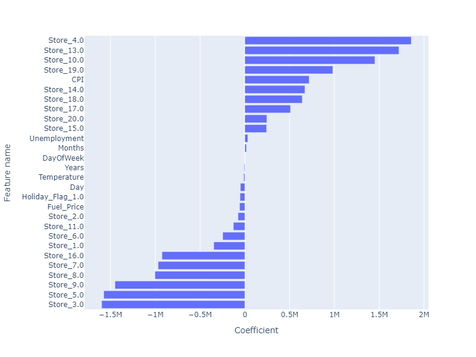
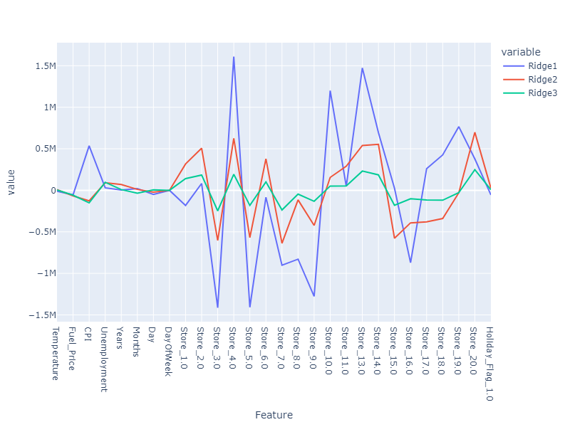
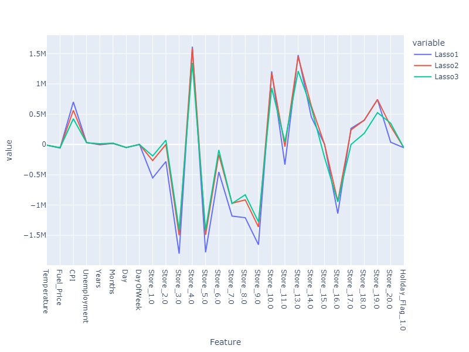
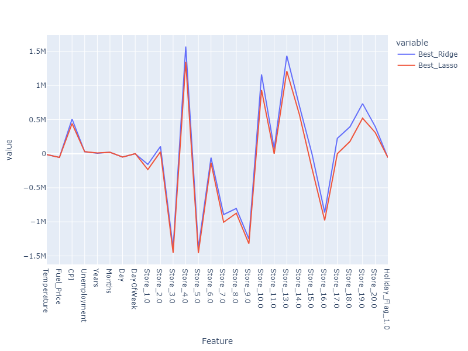

# Walmart Project

[](http://forthebadge.com) [](https://forthebadge.com)

This is the 1rst supervised machine learning project. The goal is to predict the weekly sales with ML.

## Getting Started

All the models tested are in this [Notebook](Walmart_project_YP.ipynb).
* Part 1 : EDA & Preprocessing
* Part 2 : Baseline Model - Linear Regression
* Part 3 : Fighting overfitting - Ridge & Lasso
* Conclusion

All of that with confusion matrix & f1-score evaluation 📈.

### Prerequisites

Things you need to run the codes:

```
python 3.12.1

pandas 
numpy
scikit-learn
matplotlib
plotly
plotly.express
plotly.graph_objects
```

### Some Results

Here some example of results:

* *Baseline Linear Regression*:
Score: 
```python
Cross-validated accuracy : 0.9553550974246763
standard deviation : 0.028341216024172698
R2 score on test set is finally:  0.9635628474241823 or  0.9068804153758369
and that's under the R2 score on training set : 0.9868321417045137
````
**Features importance**: 



* *Ridge*:
  


* *Lasso*:
  


* *Ridge Vs Lasso*:
  


Finally, this is with the ridge at $\alpha$ = 0.0012 that coorects the best the little overfitting of the baseline model

## Acknowledgments

* Thanks for Jedha and its instructors for the lectures, exercises and all the work.

